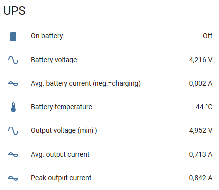

# Background script for Raspberry Pi and UPSPlus (52pi) for automatic shutdown, UPS status to MQTT, fan control

## Purpose of the script

- Runs in the background, launched as cronjob at boot time.

- Checks UPS and battery status. Shuts down the Raspberry Pi when battery voltage is under configured threshold.

- Can control a fan via a GPIO pin using PWM, depending on CPU temperature.

- Can publish UPS status and fan status data to a MQTT broker.

- Can send UPS status data to the manufacturer's IOT platform.

## Requirements

- a Geekpi UPSPlus (52pi)

- python3

- additional modules: RPi.GPIO, smbus2, pi-ina219, paho-mqtt, requests

## Installation

- Install python3 if it isn't already installed.

- Install additional modules via: pip3 install _module-name_

- Copy fanShutDownUps.py, fanShutDownUps.ini, launcher.sh into a folder (we use ~/scripts in our example)
  
  ```
  wget https://raw.githubusercontent.com/frtz13/UPSPlus_mqtt/master/fanShutDownUps.py
  ```
  
  etc. for the other files.

- Create a folder ~/logs

- Configure your options in fanShutDownUps.ini (please see below for details)

- When ready, install to crontab:
  `crontab -e`
  then add the line:
  
  ```
  @reboot sh /home/pi/scripts/launcher.sh >/home/pi/logs/cronlog 2>&1
  ```

## Configuration

#### Fan

If you want to use this option, please read Andreas Spiess' excellent article [SensorsIOT: Variable cooling fan for Raspberry Pi](https://www.sensorsiot.org/variable-speed-cooling-fan-for-raspberry-pi-using-pwm-video138/) about how to assemble the required hardware. The script can also send the fan speed percentage to your MQTT broker (default topic: `home/rpi/fanspeed`)

Configuration parameters:

**GPIO_FAN**: GPIO pin number to control the fan. Set to -1 to disable fan control completely.

**FAN_LOOP_TIME_s**: recommended value: 5. Interval for fan speed calculation.

**DESIRED_CPU_TEMP_degC**: the fan control will start to work at this temperature and try to maintain this CPU temperature.

#### UPS

At startup, the script will check if it can detect the UPS at the expected address on the i2c-bus, and deactivate communication with the UPS if the UPS does not respond.

**SEND_STATUS_TO_UPSPLUS_IOT_PLATFORM**: setting this to 1 will do the same job as the upsplus_iot.py script in https://github.com/geeekpi/upsplus. Set to 0 to avoid sending the data.

**BATTERY_CHECK_LOOP_TIME_s**: recommended value: 60. Interval for battery check and transmission of the UPS status to the MQTT broker.

**SHUTDOWN_TIMEOUT_s**: recommended value: 30 or 60, depending on how much time your Raspberry Pi needs to safely shut down. 

**PROTECTION_VOLTAGE_MARGIN_mV**: recommended value: 200. Shutdown will be triggered when the battery voltage is lower than the sum of the UPS-Plus protection voltage and this value.

#### MQTT broker

Configuration parameters for the MQTT broker should be self-explaining. If you do not want to use this feature, set BROKER to an empty value.

## Operation

I decided to write a script running continuously in the background to avoid having crontab messages every minute or so in my syslog. Putting all the functions into one script will also ensure that i2c registers will not be accessed concurrently.

#### Automatic shutdown

When the UPS Plus is on battery, a message is written every minute to the syslog, containing the current battery voltage and the critical limit.

When the measured battery voltage goes under the critical value while the UPS is on battery, the shutdown is triggered: the UPS Plus Back-To-AC-auto-power-up parameter is set, the UPS Plus shutdown countdown is started, and the Raspberry Pi is told to shut down. Thus, the Raspberry Pi should restart once AC power is back and the batteries charge again.

At startup, the script will not check the battery voltage during the first five minutes, to avoid another immediate shutdown if AC power comes back with some instability.

In addition, MQTT data will not be published during this time to leave time for the MQTT broker to start up if it runs on the same Raspberry Pi. That said, the script is supposed to reconnect to the MQTT broker in case the latter stops and restarts. 

Therefore, in a worst case scenario where cron starts the script at boot time, if erroneous values are read from the UPS Plus, or something else is wrong with the script, you should have enough time to kill the script before it attempts to shut down your Raspberry Pi.

#### MQTT

Fan data is published to the broker with the topic `home/rpi/fanspeed` (depending on your configuration). Fan PWM ratio in percent is sent every 5 seconds (by default), but only when its value changes. It is sent with the "retain" flag set.

UPS data is published to the broker with the topic `home/rpi/ups`. It is sent as a json string. Included values are:

- UsbC_V,

- UsbMicro_V,

- OnBattery (boolean; `true` when average discharging current is greater than 500mA; `false` otherwise),

- BatteryVoltage_V (as measured by the INA219 sensor at i2c address 0x45),

- BatteryCurrent_mA (positive value: discharging, negative value: charging)

- BatteryCurrent_avg_mA,

- BatteryPower_avg_mW,

- BatteryCharging (boolean, `true` if BatteryCurrent_avg_mA is negative)

- BatteryRemainingCapacity_percent,

- BatteryTemperature_degC,

- OutputVoltage_V (as measured by the INA219 sensor at i2c address 0x40),

- OutputVoltage_mini_V (minimum value during the preceding time interval of BATTERY_CHECK_LOOP_TIME_s)

- OutputCurrent_mA,

- OutputCurrent_avg_mA,

- OutputPower_avg_mW,

- OutputCurrent_peak_mA (peak value during the preceding time interval of BATTERY_CHECK_LOOP_TIME_s)

Measurements are averaged over a time interval twice as long as BATTERY_CHECK_LOOP_TIME_s.

##### Using the MQTT data

As an example, if you want to get your data into Home Assistant, you can define sensors in the Home Assistant configuration file:

```
sensor:
  - platform: mqtt
    name: "UPS average battery current"
    device_class: current
    state_topic: "home/rpi/ups"
    value_template: '{{ value_json["BatteryCurrent_avg_mA"] }}'
    unit_of_measurement: "mA"
    availability:
      - topic:  "home/rpi/LWT"
        payload_available: "online"
        payload_not_available: "offline"
```

or

```
binary_sensor:
  - platform: mqtt
    name: "UPS on Battery"
    state_topic: "home/rpi/ups"
    value_template: '{{ value_json["OnBattery"] }}'
    payload_on: "True"
    payload_off: "False"
    availability:
      - topic:  "home/rpi/LWT"
        payload_available: "online"
        payload_not_available: "offline"
```



### Getting things ready

For a first try, you may want to start the script with the `--notimerbias` command line parameter. Alternatively, you can set the following parameter in your configuration file, [ups] section: `TIMER_BIAS_AT_STARTUP = 0`. This will instruct  the script to start the UPS probing immediately, without waiting for five minutes.

Start the script: `python3 fanShutDownUps.py`

If any dependencies are missing, you will get corresponding error messages.

You can stop the script with ctrl-C.

If you do not get any error messages, switch off AC power for the UPS and have a look at the syslog (`journalctl -f`). In less than a minute, you should get a message that the UPS is on battery.

If you configured a connection to an MQTT broker, start up an MQTT client and have it listen to the `home/rpi/#` topic.

If you want to simulate a shutdown at low battery voltage, do the following in order to avoid to have to wait for a low battery situation:

Be sure to have AC power for the UPS switched on. Set the following parameter in your configuration file, [ups] section: `SHUTDOWN_IMMEDIATELY_WHEN_ON_BATTERY = 1`, and restart the script. This will instruct the script to start a shutdown sequence immediately when the UPS is on battery. Once the shutdown sequence completed and the UPS shut down power for the Raspberry Pi, you can restore AC power. The UPS should switch on, and the Raspberry Pi should start.

Once you are done with testing, comment out the `TIMER_BIAS_AT_STARTUP` and `SHUTDOWN_IMMEDIATELY_WHEN_ON_BATTERY` parameters in the configuration file, configure crontab to start the script at boot time and restart your Raspberry Pi.

## References

[UPS Plus SKU: EP-0136 - 52Pi Wiki](https://wiki.52pi.com/index.php/UPS_Plus_SKU:_EP-0136)

https://github.com/geeekpi/upsplus

https://www.sensorsiot.org/variable-speed-cooling-fan-for-raspberry-pi-using-pwm-video138/

http://www.steves-internet-guide.com/into-mqtt-python-client/
